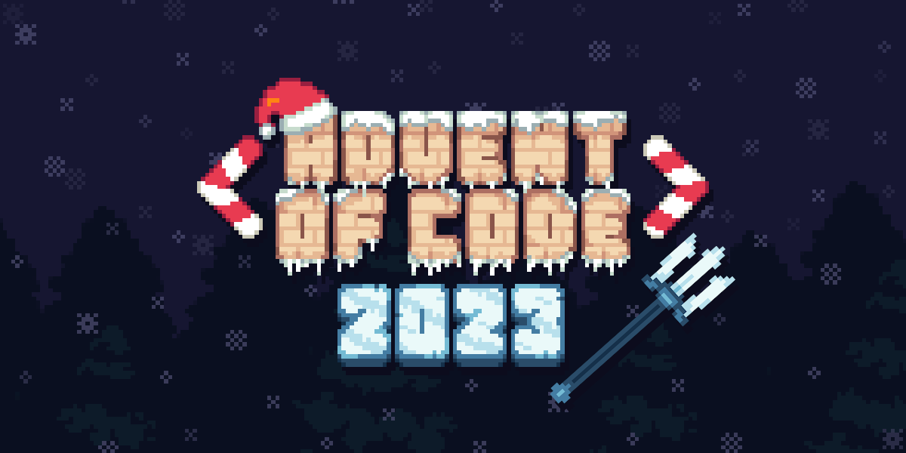

<p align="center">
	
</p>
<p align="center">
	<a href="./LICENSE">
		
	</a>
	<a href="https://github.com/LordOfTrident/aoc-2023/issues">
		
	</a>
	<a href="https://github.com/LordOfTrident/aoc-2023/pulls">
		
	</a>
	<br><br><br>
</p>

My [AOC 2023](https://adventofcode.com/2023) solutions

## Table of contents
* [Table of the days](#table-of-the-days)
* [Goals](#goals)
* [Quickstart](#quickstart)

## Table of the days
| Day        | Part 1 | Part 2 | Language |
| ---------- | ------ | ------ | -------- |
| [01](./01) |  |  | [Tokiscript](https://github.com/lordoftrident/tokiscript) |
| [02](./02) |  |  | [Tokiscript](https://github.com/lordoftrident/tokiscript) |
| [03](./03) |  |  | [Tokiscript](https://github.com/lordoftrident/tokiscript) |
| [04](./04) |  |  | [Tokiscript](https://github.com/lordoftrident/tokiscript) |
| [05](./05) |  |  | [Tokiscript](https://github.com/lordoftrident/tokiscript) |
| [06](./06) |  |  | [Rust](https://www.rust-lang.org/) |
| [07](./07) |  |  | - |
| [08](./08) |  |  | - |
| [09](./09) |  |  | - |
| [10](./10) |  |  | - |
| [11](./11) |  |  | - |
| [12](./12) |  |  | - |
| [13](./13) |  |  | - |
| [14](./14) |  |  | - |
| [15](./15) |  |  | - |
| [16](./16) |  |  | - |
| [17](./17) |  |  | - |
| [18](./18) |  |  | - |
| [19](./19) |  |  | - |
| [20](./20) |  |  | - |
| [21](./21) |  |  | - |
| [22](./22) |  |  | - |
| [23](./23) |  |  | - |
| [24](./24) |  |  | - |
| [25](./25) |  |  | - |

## Goals
My goals for AOC 2023 are:
- Try to do a few days in my own language ([Tokiscript](https://github.com/lordoftrident/tokiscript))
- Use AOC as an opportunity to learn other languages that im interested in (Elixir, Zig, Rust...)

## Quickstart
The makefile will function the same across all the day folders; `make <PART>` will run the specified part.

Part 1:
```sh
$ cd <DAY>
$ make part1
```

Part 2:
```sh
$ cd <DAY>
$ make part2
```
